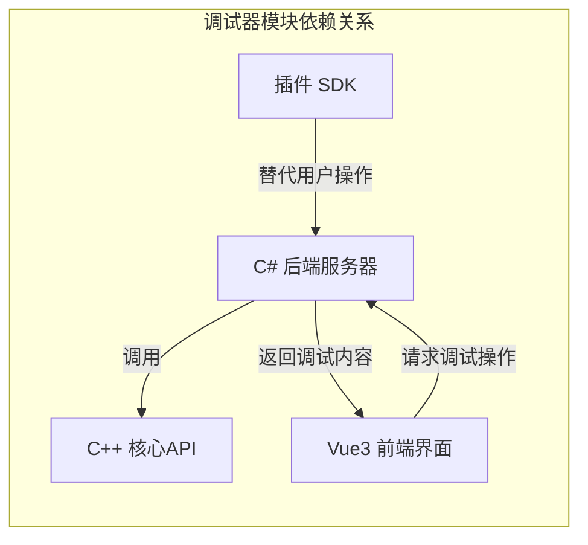
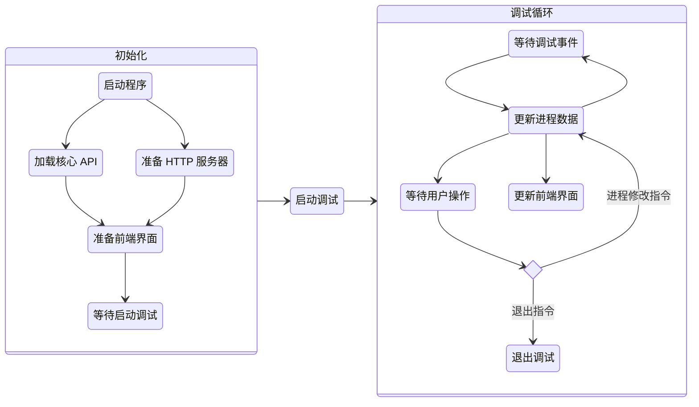
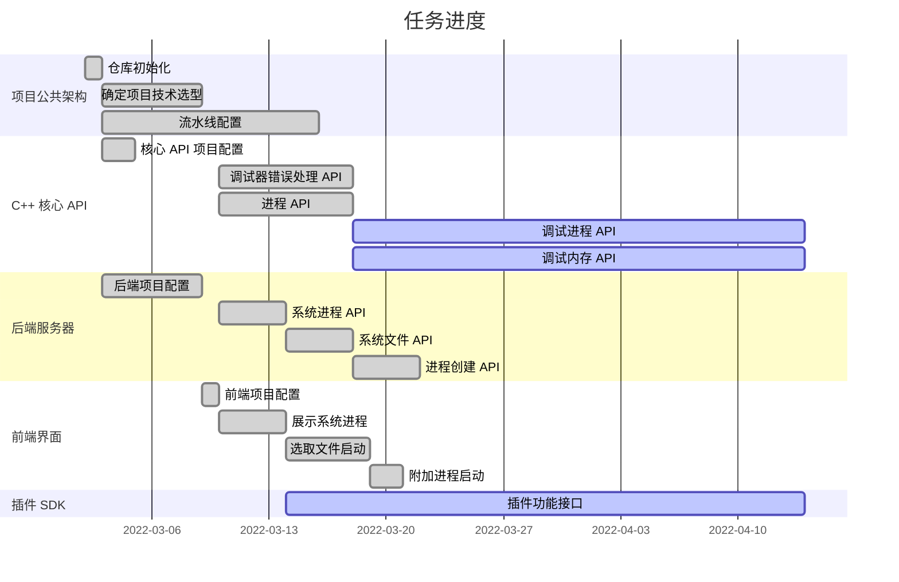

# 基于 Windows Debug API 的动态调试器

### 18074104 初雨墨

<!--
You can have `style` tag in markdown to override the style for the current page.
Learn more: https://sli.dev/guide/syntax#embedded-styles
-->

<!--
<style>
h1 {
  background-color: #2B90B6;
  background-image: linear-gradient(45deg, #4EC5D4 10%, #146b8c 20%);
  background-size: 100%;
  -webkit-background-clip: text;
  -moz-background-clip: text;
  -webkit-text-fill-color: transparent;
  -moz-text-fill-color: transparent;
}
</style> -->

---

# 项目背景

现有的调试器不利于同学们入门逆向工程

- IDA Pro: 😣 价格昂贵
- OllyDbg: 😭 年代久远，不支持 64 位程序
- WinDbg:  😫 仅支持命令行
- x64dbg:  😊 免费！图形界面！支持 64 位！😯 但是不利于同学们开发扩展

---

# 设计目的与要求

<br>

实现一个具有基本调试功能的调试器框架，并包含以下功能:

<br>

1. 提供包含基本信息的图形界面，帮助新同学快速入门逆向工程
2. 提供基于高级语言的插件 SDK，以便同学自行开发插件

---

# 项目设计


## Task: 提供包含基本信息的图形界面
- 项目采用 B/S 架构，通过浏览器实现用户界面
  - 无需关心客户端，将系统功能实现的核心部分集中到服务器上，简化了系统的开发、维护和使用
  - 技术选型
    - 用户界面: Vue
    - 服务器: C#
    - 调试器核心功能: C++

  
## Task: 提供基于高级语言的插件 SDK

- 基于 JavaScript 语言提供插件 SDK
  - JavaScript 是浏览器支持的脚本语言，无需编译，可以直接在浏览器中运行
  - JavaScript 语法简单，生态丰富


<style>
h2 {
  margin-top: 1rem;
}
</style>

---

# 项目架构

<br>

<div class="flex justify-between">

<div class="flex-1">


</div>

<div class="text-left flex-1">

- C++ 核心 API: 调用 Windows Debug API 实现调试器功能
- C# 后端服务器: 调用 C++ API 提供调试服务，并提供额外信息
- Vue3 前端界面: 接受用户操作，并使用服务器展示调试信息
- 插件 SDK: 封装调试服务接口，为前端界面提供补充信息或替代用户重复操作

</div>
</div>

---

# 运行流程




---

# 项目结构

```
BeDbg 项目   
|
+-- Api
|    |    
|    +--  // 核心 API 代码
|    
+-- BeDbg
|    |
|    +-- Client
|    |    |
|    |    +-- // 前端界面代码
|    |    
|    +-- Debugger 
|    |    +-- // 调试器代码
|    | 
|    +-- // 后端服务器代码
|
+-- Test
     |    
     +--  // 核心 API 单元测试
```

---

# 毕设进度

|            |     |
| ---------- | --- |
| 核心 API   | 85% |
| 后端服务器 | 60% |
| 前端界面   | 60% |
| 插件 SDK   | 70% |

---

# 毕设进度

支持启动 Windows 可执行文件


---

# 毕设进度

支持附加 Windows 进程


---

# 毕设进度

支持查看主线程汇编代码，与 x64dbg 比对后证实代码无误


---

# 毕设任务安排



---
layout: section
---

# Thanks
