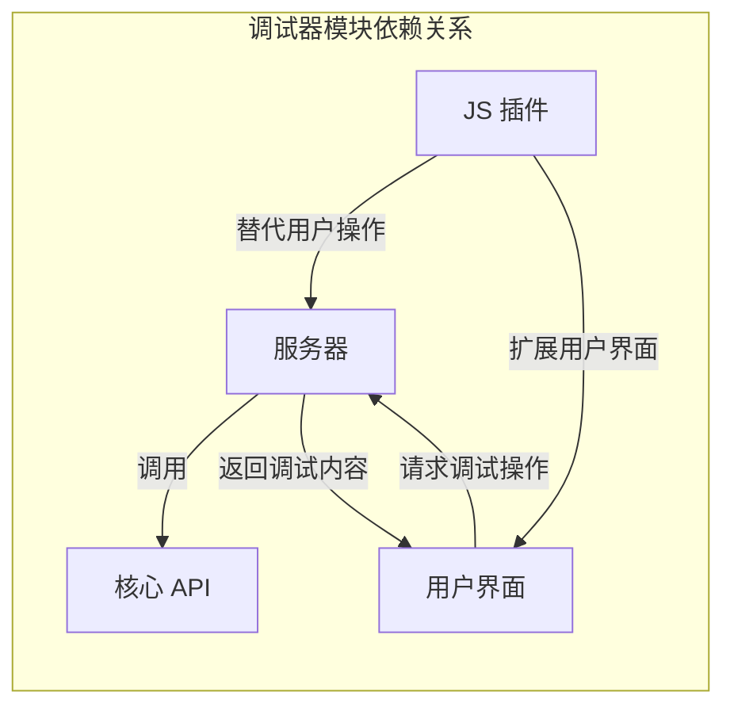

# 基于 Windows Debug API 的动态调试器

### 18074104 初雨墨

<!--
You can have `style` tag in markdown to override the style for the current page.
Learn more: https://sli.dev/guide/syntax#embedded-styles
-->

<!--
<style>
h1 {
  background-color: #2B90B6;
  background-image: linear-gradient(45deg, #4EC5D4 10%, #146b8c 20%);
  background-size: 100%;
  -webkit-background-clip: text;
  -moz-background-clip: text;
  -webkit-text-fill-color: transparent;
  -moz-text-fill-color: transparent;
}
</style> -->

---

# 项目背景

- 调试器是一种应用程序，它可以控制和修改软件的运行流程，以及查看软件运行信息 (寄存器，内存，汇编……)

- 对于逆向工程工程师来说，调试器可以帮助他们分析软件的行为，以便于识别恶意代码或是挖掘漏洞 

- 尽管现代调试器功能强大，但是它们不利于初学者入门逆向工程
  - OllyDbg: 😭 年代久远，不支持 64 位程序
    > 根据 [OllyDbg 官网](http://www.ollydbg.de/)，目前尚未支持 x64 汇编
  - WinDbg:  😫 仅支持命令行
    > 根据[微软官方文档](https://docs.microsoft.com/en-us/windows-hardware/drivers/debugger/debugging-using-windbg-preview)，预览版本已经支持图形界面，但交互方式依然使用命令行形式
  - x64dbg:  😊 免费！图形界面！支持 64 位！😯 但是 C++ SDK 不利于开发扩展
    > C++ 语言难度较高，如想修改图形界面还需要 QT 框架使用经验 

---

# 设计目的与要求

<br>

实现一个具有基本调试功能的调试器框架，并包含以下功能:

<br>

1. 提供包含基本信息的图形界面，帮助初学者入门逆向工程
2. 提供基于高级语言的插件 SDK，以便自行开发插件

---

# 项目设计


## Task: 提供包含基本信息的图形界面
- 项目采用 B/S 架构，通过浏览器实现用户界面
  - 无需关心客户端，将系统功能实现的核心部分集中到服务器上，简化了系统的开发、维护和使用
  - 技术选型
    - 用户界面: Vue
    - 服务器和调试器主框架: C#
    - 调试器核心功能: C++

  
## Task: 提供基于高级语言的插件 SDK

- 基于 JavaScript 语言提供插件 SDK
  - JavaScript 是浏览器支持的脚本语言，无需编译，可以直接在浏览器中运行
  - JavaScript 语法简单，生态丰富


<style>
h2 {
  margin-top: 1rem;
}
</style>

---

# 项目架构

<br>

<div class="flex justify-between">

<div class="flex-1">


</div>

<div class="text-left flex-1">

- 核心 API: 调用 Windows Debug API 实现调试器核心功能
- 服务器: 调用核心 API 形成调试器本体，对外提供调试服务
- 用户界面: 展示调试数据；接受用户操作，告知服务器进行数据更新
- 插件 SDK: 封装调试服务接口，可扩展用户界面提供补充信息或替代用户重复操作

</div>
</div>

---

# 运行流程


---

# 毕设进度

|            |     |
| ---------- | --- |
| 核心 API   | 85% |
| 服务器     | 60% |
| 用户界面   | 60% |
| 插件 SDK   | 50% |

+ ☑ 已完全实现调试器初始化
+ ☑ 支持从可执行程序/用户进程启动调试
+ 🔜 调试循环正在开发中
  + ☑ 监听并处理系统事件
  + ☑ 支持从进程读取汇编、内存等底层信息
  + 🔜 正在构建用户操作监听机制


<style>
ul {
  @apply mt-4;
}

li ul {
  @apply mt-0;
}
</style>

---

## 支持启动 Windows 可执行文件


---

## 调试循环实现

```cpp {1-2,7-8,12,15,17,20,22}
DebugContinueStatus Internal::dispatchDebugEvent(const DEBUG_EVENT* event, const DebugLoopCallbacks* callbacks) {
    const auto eventCode = event->dwDebugEventCode;

    if (eventCode < EXCEPTION_DEBUG_EVENT || eventCode > RIP_EVENT) {
        // ... 错误处理
    }
    const auto cbArr = static_cast<DebugEventCallback<>*>(static_cast<void*>(callbacks));
    const auto cb = cbArr[eventCode - 1];
    if (cb == nullptr) {
        return DebugContinueStatus::Continue;
    }
    return cb(event->dwProcessId, event->dwThreadId, &event->u);
}

DebugContinueStatus BeDbgApi::Debug::DebugLoopWaitEvent(const DebugLoopCallbacks* callbacks) {
    DEBUG_EVENT event;
    if (!WaitForDebugEvent(&event, INFINITE)) {
        // ... 错误处理
    }
    const auto result = Internal::dispatchDebugEvent(&event, callbacks);
    const auto debugStatusCode = result == DebugContinueStatus::Continue ? DBG_CONTINUE : DBG_EXCEPTION_NOT_HANDLED;
    ContinueDebugEvent(event.dwProcessId, event.dwThreadId, debugStatusCode);
    return result;
}
``` 

<style>
h1 {
  @apply mb-0;
}
</style>

---

## 调试循环实现

```csharp {4-5,8,13,15-18,22}
public abstract class BaseDebugger {
  protected BaseDebugger()
	{
		// 创建调试循环
		_debugLoop = Task.Factory.StartNew(() =>
		{
			Kernel.DebugActiveProcess(pid);
			DebugLoop();
			Kernel.DebugActiveProcessStop(pid);
		}, TaskCreationOptions.LongRunning);
	}

  protected void DebugLoop()
	{
		Process.EnterDebugMode();
		while (DoDebugLoop)
		{
			if (!DebugLoopWaitEvent(CallbackHandle))
			{
				// ... 错误处理
			}
		}
	}
}
```

<style>
h1 {
  @apply mb-0;
}
</style>

---

# 毕设进度

支持查看主线程汇编代码，与 x64dbg 比对后证实代码无误


---

# 后续

```mermaid

gantt
  title 任务时间安排
  dateFormat YYYY-MM-DD

  section C++ 核心 API
  查漏补缺: active, api-add-and-fix, now, 3w

  section 后端服务器
  前后端通信机制: active, websocket-loop, now, 1w
  接收用户操作: server-controllers, after websocket-loop, 1w

  section 前端界面
  用户界面设计: client-ui, after websocket-loop, 1w

  section 插件 SDK
  插件功能接口 :active, plugin-sdk,  now, 2w
  插件界面扩展接口 : after websocket-loop, 1w

  section 收尾工作
  bug 修复: bug-fix, after client-ui, 3d
  生产环境测试: after bug-fix, 4d

```

---
layout: section
---

# Thanks
