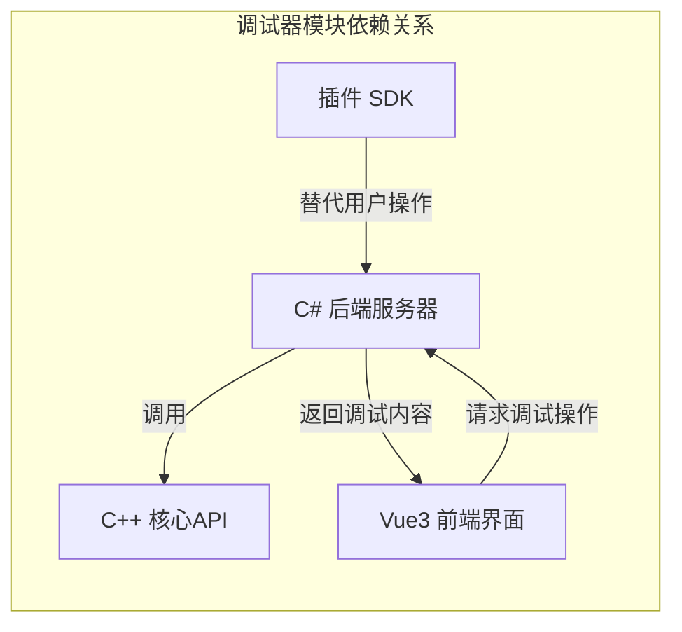
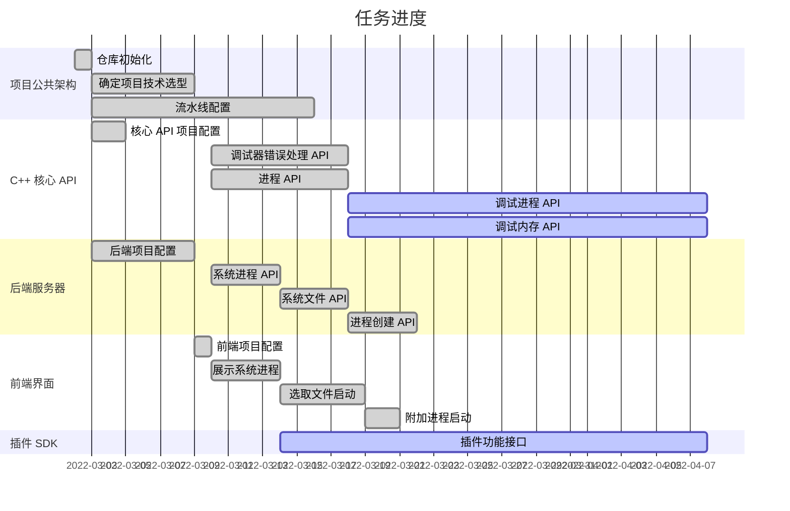

# 基于 Windows Debug API 的动态调试器

### 18074104 初雨墨

<!--
You can have `style` tag in markdown to override the style for the current page.
Learn more: https://sli.dev/guide/syntax#embedded-styles
-->

<!--
<style>
h1 {
  background-color: #2B90B6;
  background-image: linear-gradient(45deg, #4EC5D4 10%, #146b8c 20%);
  background-size: 100%;
  -webkit-background-clip: text;
  -moz-background-clip: text;
  -webkit-text-fill-color: transparent;
  -moz-text-fill-color: transparent;
}
</style> -->

---

# 设计目的与要求

<br>

实现一个具有基本调试功能的调试器框架，并包含以下功能:

<br>

1. 提供包含基本信息的图形界面，帮助新同学快速入门逆向工程
2. 提供基于高级语言的插件 SDK，以便同学自行开发插件

---

# 项目架构

<br>

<div class="flex justify-between">

<div class="flex-1">


</div>

<div class="text-left flex-1">

- C++ 核心 API: 调用 Windows Debug API 实现调试器功能
- C# 后端服务器: 调用 C++ API 提供调试服务，并提供额外信息
- Vue3 前端界面: 接受用户操作，并使用服务器展示调试信息
- 插件 SDK: 封装调试服务接口，为前端界面提供补充信息或替代用户重复操作

</div>
</div>

---

# 难点突破

## Q: C# 调用 C++ 模块时，常常出现未知调用错误

C# 调用
``` csharp
[DllImport("BeDbgApi-x64.dll", EntryPoint = "QueryProcessModules")]
private static extern unsafe bool QueryProcessModules(IntPtr handle, 
  [Out] ProcessModuleInformation[] modules,
  uint count, uint* usedCount);
```

C++ 实现
```cpp
bool QueryProcessModules(Type::handle_t handle,  
  ProcessModuleInformation modules[], 
  size_t count, size_t* usedCount);
```

---

# 难点突破

## A: 由于 C# 不知道如何转换结构体，因此出现错误

此时应当手动指定结构体转换行为

<div class="flex">

<div class="flex-1 mr-6 border-box">

C# 定义
```csharp {all|1,4,5}
[StructLayout(LayoutKind.Sequential, Pack = 8, CharSet = CharSet.Unicode)]
public struct ProcessModuleInformation
{
	[MarshalAs(UnmanagedType.ByValTStr, SizeConst = 260)]
	public string Name;
	public ulong Entry;
	public uint Size;
	public ulong ImageBase;
}
```
</div>

<div>

C++ 定义
```cpp {all|3}
struct ProcessModuleInformation
{
    wchar_t name[260];
    std::uint64_t entry;
    std::uint32_t size;
    std::uint64_t imageBase;
};
```

</div>
</div>


---

# 毕设进度

|            |     |
| ---------- | --- |
| 核心 API   | 30% |
| 后端服务器 | 20% |
| 前端界面   | 20% |
| 插件 SDK   | 5%  |

---


# 毕设任务安排



<style>
  .slidev-layout.default {
    overflow-x: scroll;
    overflow-y: hidden;
  }
</style>

---
layout: section
---

# Q & A


---
layout: section
---

# Thanks
